# Multi-Channel Digital Fault Detection and Isolation System

**RTL-to-GDSII ASIC Implementation using Open-Source VLSI Tools**

## Overview

This project focuses on the design and implementation of a digital fault detection and isolation system for multiple monitored channels.

The system monitors four independent digital channels and detects whether a fault is present. When a fault is detected, the system identifies the affected channel using a priority-based fault isolation mechanism.

The complete project is intended to follow an ASIC RTL-to-GDSII design flow using open-source VLSI tools.

## Project Objectives

- Design a multi-channel digital fault detection system.
- Detect faults across four monitored channels.
- Isolate the affected channel using priority logic.
- Verify the RTL functionality using simulation.
- Perform logic synthesis and physical design.
- Complete the ASIC flow up to GDSII generation.
- Analyze timing and physical design results.

## System Specification

### Inputs

| Signal | Description |
|--------|-------------|
| `clk` | System clock |
| `rst` | Synchronous reset |
| `ch1` | Channel 1 fault input |
| `ch2` | Channel 2 fault input |
| `ch3` | Channel 3 fault input |
| `ch4` | Channel 4 fault input |

### Outputs

| Signal | Description |
|--------|-------------|
| `fault` | Indicates whether a fault is detected |
| `fault_code[3:0]` | Identifies the detected fault channel |

## Fault Code Mapping

| Channel Condition | Fault Code | Meaning |
|-------------------|------------|---------|
| No fault | `0000` | No fault detected |
| CH1 | `1000` | Channel 1 fault |
| CH2 | `0100` | Channel 2 fault |
| CH3 | `0010` | Channel 3 fault |
| CH4 | `0001` | Channel 4 fault |

### Fault Priority

When multiple channels are faulty simultaneously, the system uses the following priority:

```text
CH1 > CH2 > CH3 > CH4
```

## Architecture

Four fault inputs feed priority-based detection logic. Clocked registers store the fault status and code, with synchronous reset.

## Tools and Technology

- Verilog HDL
- Icarus Verilog and GTKWave
- Yosys synthesis
- OpenLane RTL-to-GDSII flow
- SKY130A `sky130_fd_sc_hd` standard-cell library
- OpenSTA, Magic, and Netgen

## Verification Results

### RTL Simulation
Six test cases passed: no fault, individual faults on CH1–CH4, and CH1 priority when multiple inputs are active.

### Synthesis
Yosys synthesis completed successfully. The recorded synthesis report lists 11 cells.

### Physical Design
The OpenLane flow completed floorplanning, placement, clock-tree synthesis, routing, and GDSII generation.

- Core dimensions: approximately 25.76 × 24.48 µm
- Core area: approximately 630.60 µm²
- Die dimensions: approximately 36.84 × 47.56 µm
- Die area: approximately 1751.51 µm²

### Physical Verification
- Magic DRC report: `COUNT: 0`
- LVS: circuits match uniquely, with 34 devices and 34 nets on each side.
- Recorded antenna checks: zero violating pins and zero violating nets.

### Static Timing Analysis

Pre-route, library-based checks were performed using a 10 ns clock period.

| Corner | Input-to-register slack | Register-to-output slack |
|---|---:|---:|
| TT | +7.81 ns | +7.73 ns |
| SS | +7.59 ns | +7.42 ns |
| FF | +7.88 ns | +7.83 ns |

The displayed paths are marked MET. The logs report WNS = 0.00 and TNS = 0.00.

**Limitation:** These are pre-route checks using the synthesized netlist and one Liberty library per run, not routed-parasitic STA for all three corners. A separate existing SPEF-based report records +6.63 ns slack for its reported maximum-delay path.

## Project Structure

RTL, testbench, simulation, synthesis, physical-design, and timing files are organized in their respective folders. Screenshots are stored in `images/`, reports in `reports/`, and the generated layout at `gds/fault_detection.gds`.

## Conclusion

The four-channel fault detection design was simulated, synthesized, and taken through the OpenLane physical-design flow to GDSII generation. The recorded reports show zero Magic DRC count and a unique LVS circuit match. Pre-route timing checks were completed for the TT, SS, and FF libraries.
## Project Gallery

### Architecture
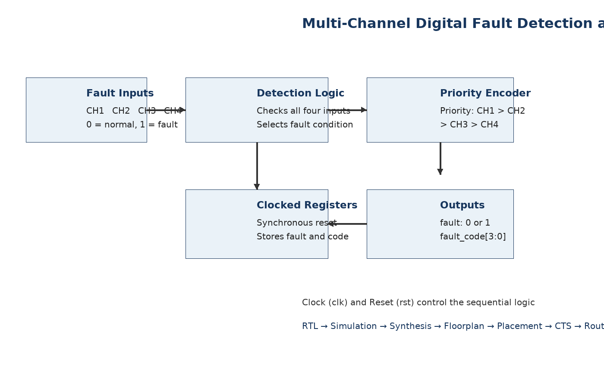

### RTL Verification
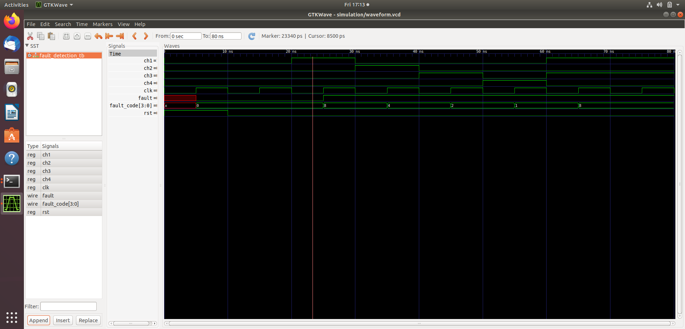

### Synthesis
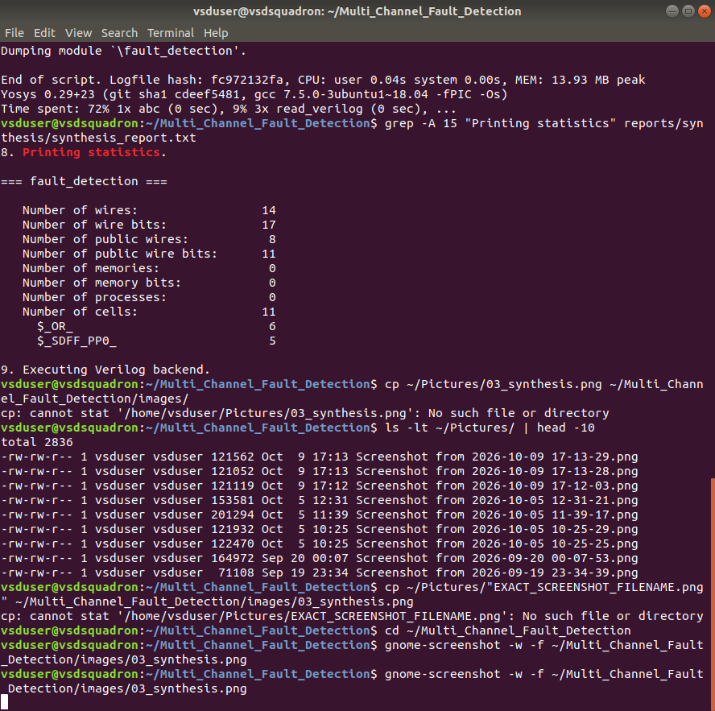

### Physical Design
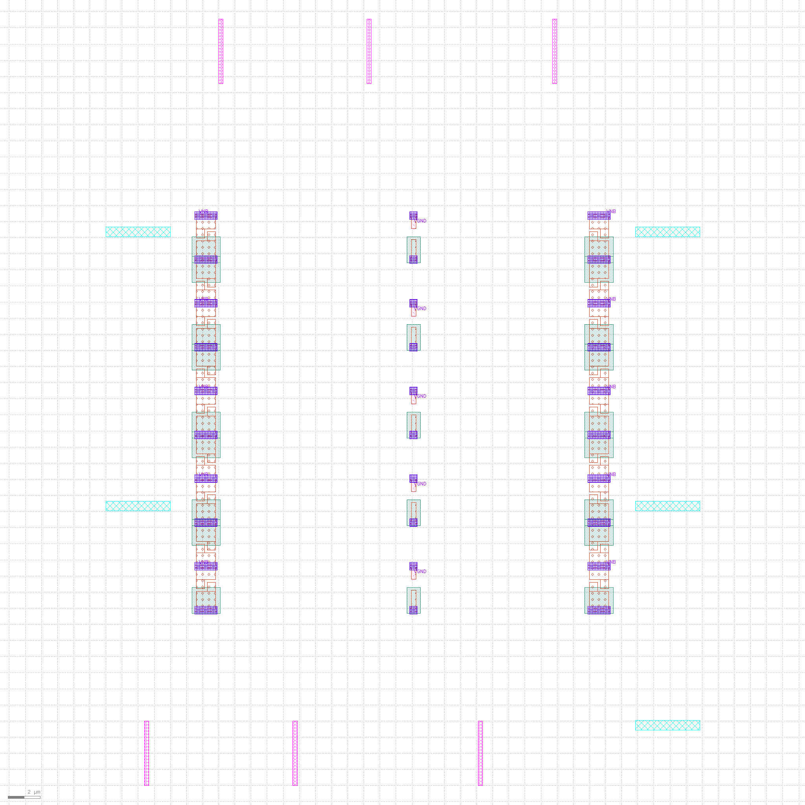
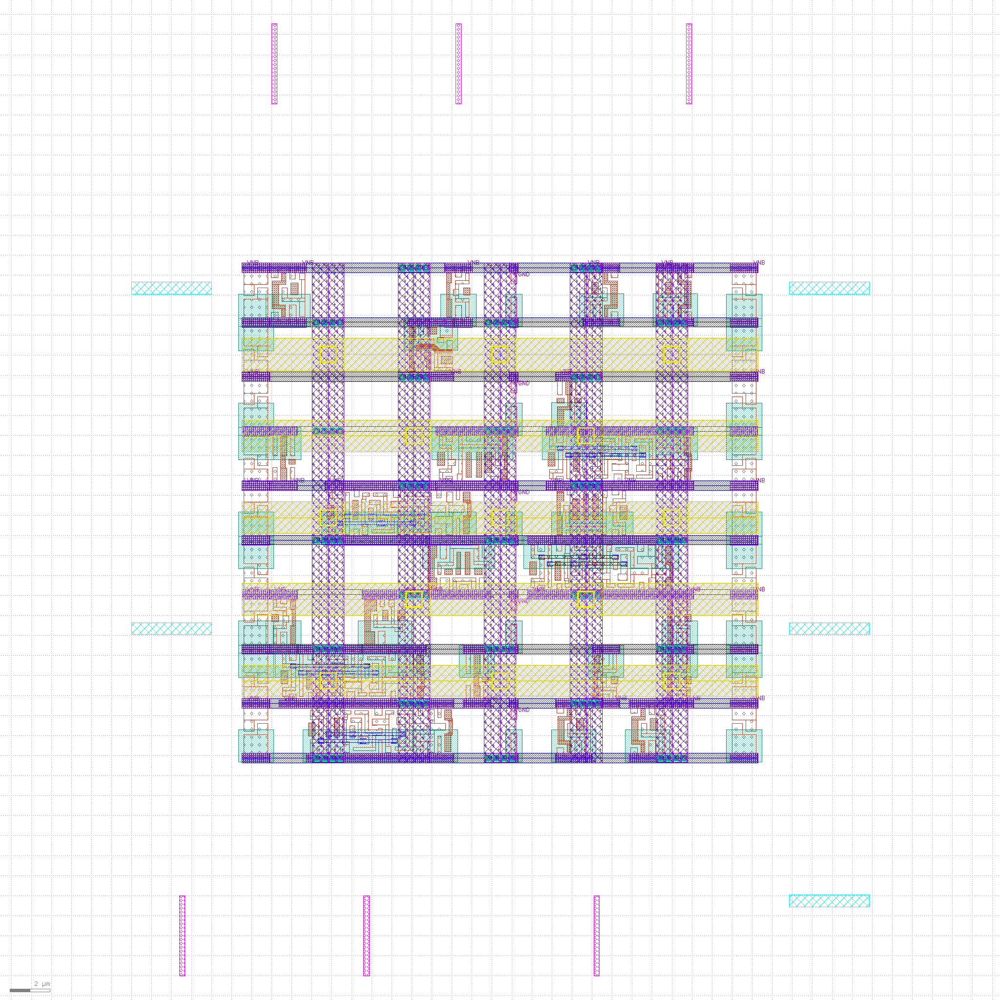
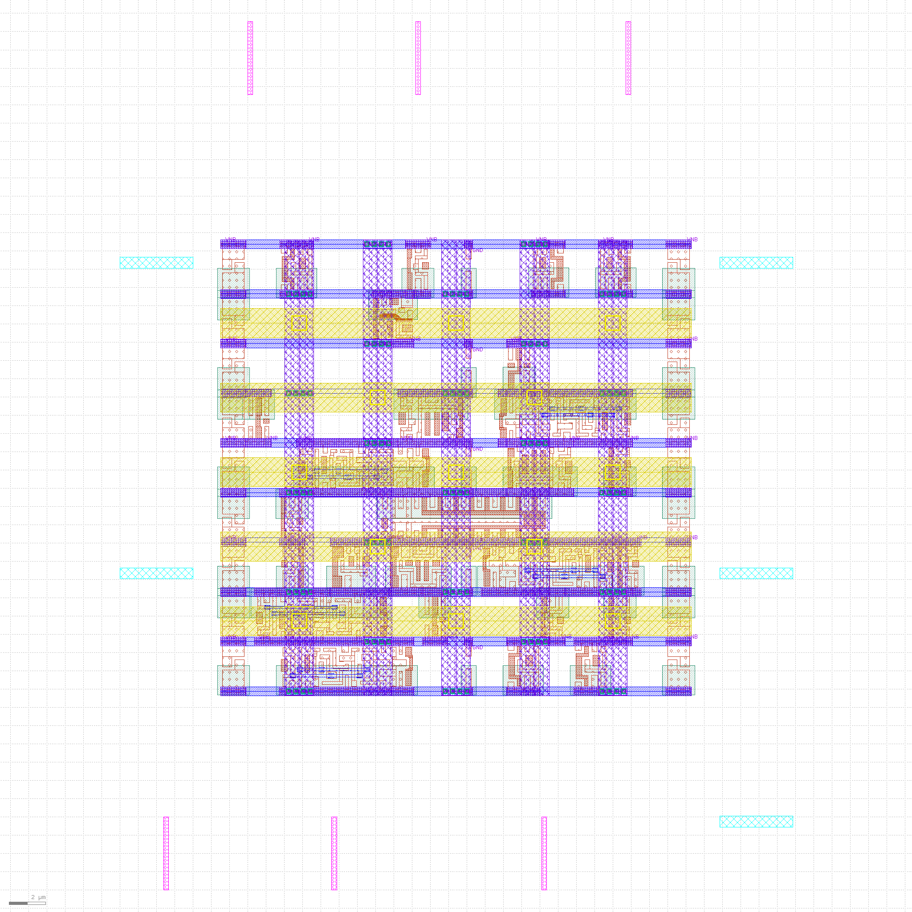
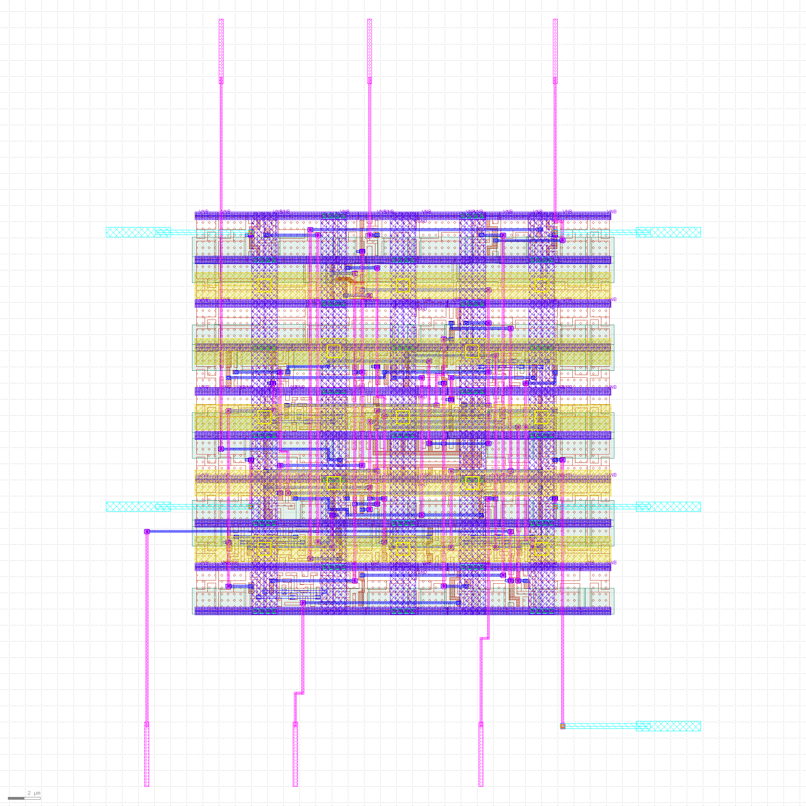

### Timing and Physical Verification
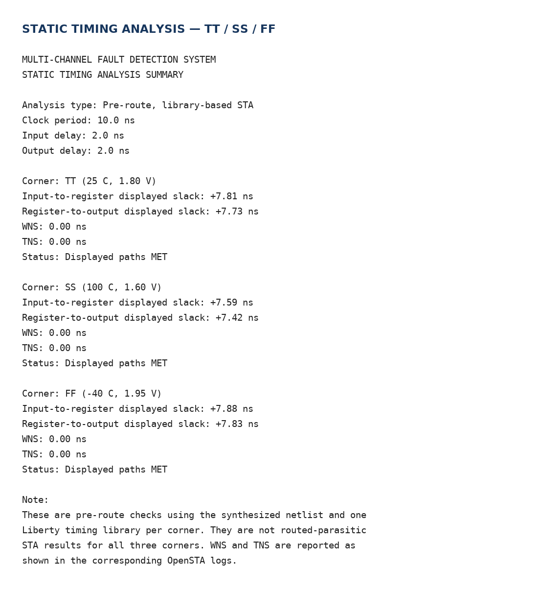
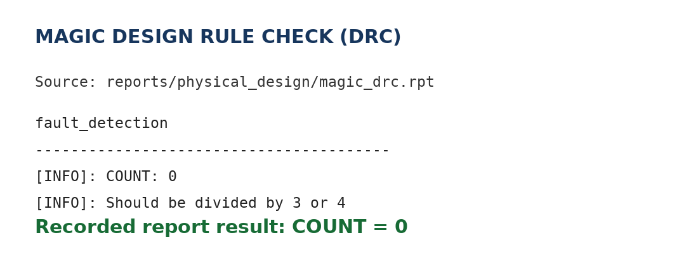
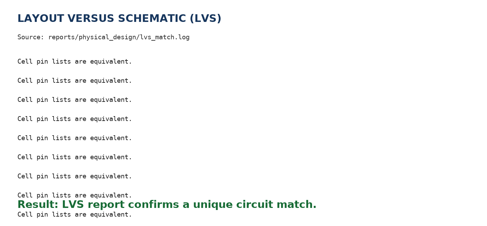

### GDSII and Final Results
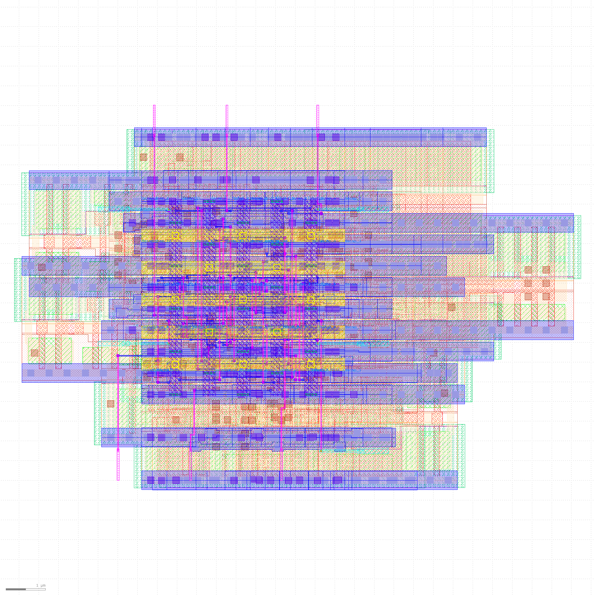
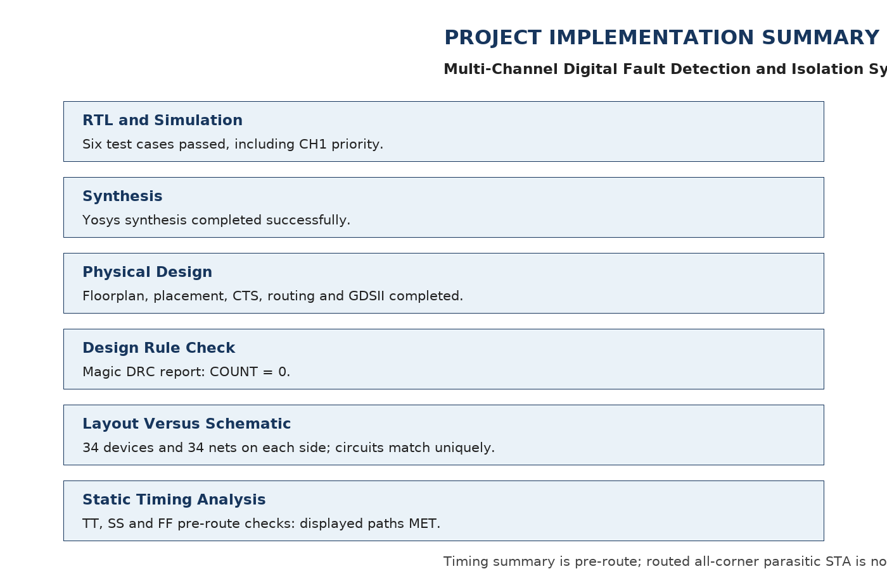
